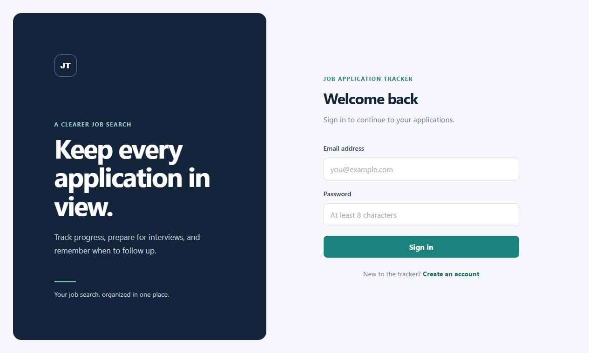
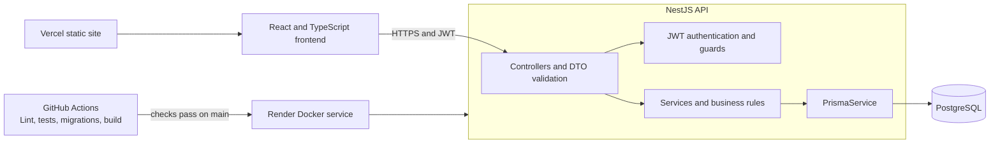

# Job Application Tracker

[](https://github.com/thatsalgoritma/job-application-tracker/actions/workflows/ci.yml)

A full-stack application for recording job applications, tracking their progress, and organizing interviews. The React frontend connects to a NestJS REST API so job seekers can manage applications, review progress, and follow up on opportunities.



## Architecture



## Tech stack

- Node.js 20 and TypeScript
- NestJS modules, controllers, services, and dependency injection
- PostgreSQL with Prisma Client and checked-in migrations
- Passport JWT authentication and bcrypt password hashing
- `class-validator` DTO validation and a consistent exception filter
- Jest and Supertest
- Swagger UI via `@nestjs/swagger`
- Docker, Docker Compose, GitHub Actions, and Render
- React, TypeScript, Vite, and Vercel for the frontend

## Key design decisions

- **Modules by domain:** authentication, applications, interviews, and Prisma have separate modules, keeping responsibilities easy to find and change.
- **DTOs separate from database models:** incoming data is validated at the API boundary before business logic uses it.
- **Ownership enforced in the service layer:** database queries include the authenticated user's ID, preventing access to another user's records even when a resource ID is known. Missing and unowned resources return `404`.
- **Status changes are explicit business rules:** invalid application status transitions return a clear client error; terminal statuses cannot be reopened.
- **Migrations are committed:** local, CI, and deployment environments apply the same schema changes through Prisma migrations. The container applies pending migrations before starting the API.
- **One error response shape:** the global exception filter returns `statusCode`, `timestamp`, `path`, `message`, and `error` consistently.

## Run locally

Prerequisites: Node.js 20+, npm, and PostgreSQL. Create an empty database named `job_tracker`, then configure the connection string and a private JWT secret in `.env`.

```powershell
Copy-Item .env.example .env
```

Edit `.env` and set `DATABASE_URL` to your local PostgreSQL connection and `JWT_SECRET` to a random value of at least 32 characters. Keep `.env` private; it is ignored by Git.

```powershell
npm ci
npm run prisma:generate
npm run prisma:migrate:dev
npm run start:dev
```

The API listens at `http://localhost:3000`. Health check: `http://localhost:3000/health`.

In another terminal, start the frontend:

```powershell
cd frontend
Copy-Item .env.example .env
npm ci
npm run dev
```

The frontend opens at `http://localhost:5173`. Its local `.env` uses `VITE_API_BASE_URL=http://localhost:3000`; the backend's `FRONTEND_ORIGIN` must include `http://localhost:5173` for CORS.

## Run with Docker Compose

Prerequisite: Docker Desktop with Docker Compose. Copy `.env.example` to `.env` if needed, then set `POSTGRES_PASSWORD` and `JWT_SECRET` to private values. Compose runs PostgreSQL, applies migrations, and starts the API.

```powershell
docker compose up --build
```

The API is available at `http://localhost:3000`; PostgreSQL is exposed to the host on port `5433` by default. Data remains in the named `postgres-data` volume after `docker compose down`; `docker compose down --volumes` also removes it.

## Tests and checks

```powershell
npm run lint
npm test
npm run test:e2e
npm run build
```

Frontend checks are run from `frontend`:

```powershell
npm test
npm run build
```

Unit and e2e tests use test doubles for Prisma, so they do not require a local database. GitHub Actions also starts PostgreSQL and applies the migrations, then runs the checks and builds the production Docker image on every push and pull request.

## API overview

Swagger UI: [`/api`](http://localhost:3000/api) when running locally. Resource endpoints require `Authorization: Bearer <accessToken>`.

| Method | Endpoint | Purpose |
| --- | --- | --- |
| `POST` | `/auth/register` | Create an account and receive a JWT |
| `POST` | `/auth/login` | Log in and receive a JWT |
| `GET` | `/me` | Read the authenticated user's profile |
| `POST` | `/applications` | Create an application |
| `GET` | `/applications` | List, search, filter, sort, and paginate applications |
| `GET` | `/applications/:id` | Read an application |
| `PATCH` | `/applications/:id` | Update an application and its status |
| `DELETE` | `/applications/:id` | Delete an application |
| `GET` | `/applications/follow-up?days=7` | Find active applications unchanged for the requested number of days |
| `GET` | `/applications/stats` | Get counts by status and response rate |
| `GET`, `POST` | `/applications/:id/interviews` | List or schedule interviews for an application |
| `GET`, `PATCH`, `DELETE` | `/applications/:id/interviews/:interviewId` | Read, update, or delete an interview |
| `GET` | `/health` | Check that the API process is responding |

Application statuses are `APPLIED`, `SCREENING`, `INTERVIEW`, `OFFER`, `REJECTED`, and `WITHDRAWN`. Filtering supports status, company, applied date range, and text search; list responses include pagination metadata. The response-rate denominator excludes withdrawn applications; rejected applications count as responses.

## Live demo

The API is deployed on Render:

- [Live API](https://job-application-tracker-api-3x9f.onrender.com/)
- [Swagger UI](https://job-application-tracker-api-3x9f.onrender.com/api)
- [Health check](https://job-application-tracker-api-3x9f.onrender.com/health)

The frontend deploys to Vercel. Once deployed, add its URL here:

- Frontend demo: _add the URL shown by Vercel after the first deploy_

To deploy it, first push this repository state to GitHub. In Vercel, select **Add New → Project**, import `thatsalgoritma/job-application-tracker`, and set **Root Directory** to `frontend`. Vercel should detect Vite; use `npm run build` and `dist` if it asks for the build command and output directory. In **Environment Variables**, add `VITE_API_BASE_URL` with value `https://job-application-tracker-api-3x9f.onrender.com` for the Production environment, then deploy. The [`frontend/vercel.json`](frontend/vercel.json) rewrite lets direct visits and refreshes on `/applications/:id` and `/insights` load the SPA. Copy the production `*.vercel.app` domain into the frontend demo link above. In the Render dashboard, open the API service's **Environment** settings, set `FRONTEND_ORIGIN` to that exact origin (no trailing slash), save, and redeploy the API. The Vercel Hobby plan is free for personal, non-commercial projects, which fits this portfolio demo; it is not intended for commercial use. See [Vercel Hobby plan details](https://vercel.com/docs/plans/hobby), [Vite deployment docs](https://vercel.com/docs/frameworks/frontend/vite), and [Vercel monorepo setup](https://vercel.com/docs/monorepos).

Vercel is used for the frontend because it builds and hosts this Vite app as static files and deploys changes pushed to the connected GitHub repository. The API remains on Render; the browser sends authenticated requests to it over HTTPS. `VITE_API_BASE_URL` is public client configuration compiled into the JavaScript bundle, not a secret.

Render deploys commits to `main` after the GitHub Actions checks pass. Set `DATABASE_URL` and `JWT_SECRET` as Render environment variables; do not commit production secrets. The current Render free service may sleep after inactivity. See [Render's free plan limits](https://render.com/docs/free).

## What I'd improve next

- Add rate limiting and structured request logging, with request IDs for tracing.
- Add a real PostgreSQL integration-test suite in addition to the mocked e2e tests.
- Add refresh-token rotation, account recovery, and email verification.
- Add database backup and restore procedures and deployment monitoring.
